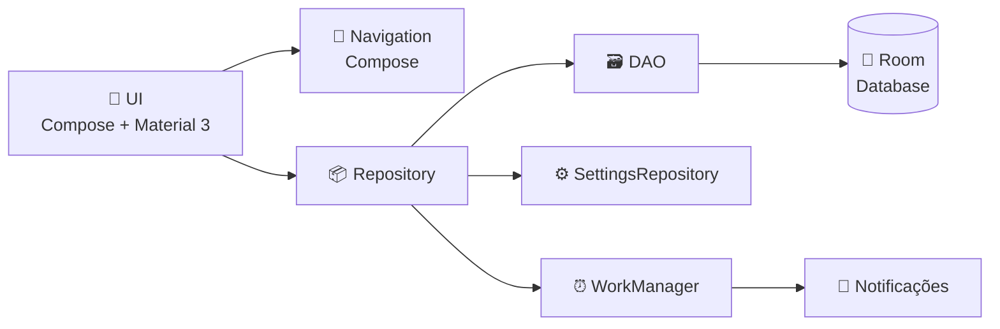

<div align="center">

# 📅 RastreadorPrazo

**Nunca mais perca um vencimento.**
Organize contas, faturas e prazos com lembretes inteligentes, calendário e controle de status — tudo em um app Android moderno.

<br>


</div>

---

## 📱 Screenshots

<div align="center">

| Lista | Detalhes | Calendário | Ajustes | Notificações |
|:---:|:---:|:---:|:---:|:---:|
|  |  |  |  |  |

</div>

---

## ✨ Funcionalidades

| | Recurso | Descrição |
|:---:|---|---|
| 📋 | **Lista de obrigações** | Busca por título ou favorecido e filtro por status |
| ✏️ | **Cadastro e edição** | Título, tipo (Prazo ou Fatura), valor, favorecido, vencimento e horário do lembrete |
| 🔍 | **Detalhes** | Ações rápidas para marcar como paga, cancelar ou excluir |
| 🗓️ | **Calendário** | Visão mensal de todos os vencimentos |
| 🔔 | **Notificações** | Lembretes agendados com WorkManager, com ação *Marcar como paga* direto na notificação |
| ⚙️ | **Ajustes** | Tema sistema/claro/escuro e liga/desliga global de notificações |

### 🏷️ Status das obrigações

> 🟡 **Pendente** — aguardando pagamento
> 🟢 **Paga** — quitada
> 🔴 **Cancelada** — não precisa mais ser paga

---

## 🏗️ Arquitetura



<details>
<summary><b>📂 Estrutura de pastas</b> (clique para expandir)</summary>

```
app/src/main/java/com/example/rastreadorprazo/
├── data/            # Entidade Obrigacao, DAO, Database, Repository, SettingsRepository
├── notification/    # Agendamento e disparo de notificações (WorkManager)
├── ui/
│   ├── components/  # Componentes reutilizáveis (cards, chips, bottom bar...)
│   ├── navigation/  # Rotas e NavHost
│   ├── screens/     # Lista, Nova/Editar, Detalhes, Calendário, Notificações, Ajustes
│   └── theme/       # Cores, tipografia e tema Material 3
└── MainActivity.kt
```

</details>

---

## 🛠️ Tecnologias

| Camada | Tecnologia |
|---|---|
| Linguagem | Kotlin |
| Interface | Jetpack Compose + Material 3 |
| Persistência | Room |
| Navegação | Navigation Compose |
| Tarefas em segundo plano | WorkManager |

---

## 🚀 Como executar

**Requisitos**

- Android Studio (versão compatível com o AGP/Kotlin do projeto)
- SDK mínimo **24** (Android 7.0) · SDK alvo **36**

**Pelo Android Studio**

1. Abra a pasta `RastreadorPrazo`
2. Aguarde a sincronização do Gradle
3. Rode a configuração `app` em um emulador ou dispositivo físico ▶️

**Pela linha de comando**

```bash
cd RastreadorPrazo
./gradlew installDebug
```

---

<div align="center">

## 👩‍💻 Autora

**Ranielly Ferreira**

Feito com 💜 e Kotlin

</div>
